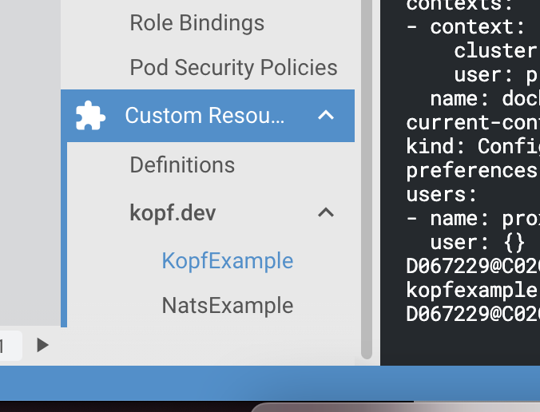

# kopf-test
## How to use
1. build main operator docker images


	```
	docker build -t kopf/operator-test .
	```


2. build nats operator docker images

	```
	docker build -t cheng/nats-operator-test .
	```


3. deploy admin role


	```
	kubectl apply -f role.yaml

	```


4. deploy CRD


	```
	kubectl apply -f crd.yaml

	```


	```
	kubectl apply -f nats_crd.yaml

	```

	You will see 2 CRDs are created.
	
5. deploy operators

	```
	kubectl apply -f ./main_operator/deployment.yaml

	```


	```
	kubectl apply -f ./main_operator/nats.yaml

	```

5. deploy new CRD object (new tenant on boarding)

	```
	kubectl apply -f obj.yaml

	```

	in the log of the operator, you can see step 1 and step 2 are excuted in pre-defined sequence
	
	```
	2022-01-28 08:58:55,575] kopf.objects         [INFO    ] [default/kopf-example-1] step 1: upload blob! 
	
	[2022-01-28 08:58:55,578] kopf.objects         [INFO    ] [default/kopf-example-1] Handler 'create_blob_storge' succeeded.

	[2022-01-28 08:58:55,579] kopf.objects         [DEBUG   ] [default/kopf-example-1] Patching with: {'metadata': {'annotations': {'kopf.zalando.org/create_blob_storge': '{"started":"2022-01-28T08:58:55.429661","stopped":"2022-01-28T08:58:55.578644","purpose":"create","retries":1,"success":true,"failure":false}'}}, 'status': {'kopf': {'progress': {'create_blob_storge': {'started': '2022-01-28T08:58:55.429661', 'stopped': '2022-01-28T08:58:55.578644', 'delayed': None, 'purpose': 'create', 'retries': 1, 'success': True, 'failure': False, 'message': None, 'subrefs': None}}}, 'create_blob_storge': {'name': 'my_blob'}}}

	[2022-01-28 08:58:55,610] kopf.objects         [DEBUG   ] [default/kopf-example-1] Sleeping was skipped because of the patch, 9.852868 seconds left.

	[2022-01-28 08:58:55,715] kopf.objects         [DEBUG   ] [default/kopf-example-1] Sleeping for 9.716797 seconds for the delayed handlers.

	[2022-01-28 08:59:05,410] kopf.objects         [DEBUG   ] [default/kopf-example-1] Patching with: {'metadata': {'annotations': {'kopf.zalando.org/touch-dummy': '2022-01-28T08:59:05.410610'}}, 'status': {'kopf': {'dummy': '2022-01-28T08:59:05.410610'}}}

	[2022-01-28 08:59:05,557] kopf.objects         [DEBUG   ] [default/kopf-example-1] Handler 'create_nats' is invoked.

	[2022-01-28 08:59:05,558] kopf.objects         [INFO    ] [default/kopf-example-1] my_blob is created 

	[2022-01-28 08:59:05,560] kopf.objects         [INFO    ] [default/kopf-example-1] step 2: Creating nats! 

	[2022-01-28 08:59:05,561] kopf.objects         [INFO    ] [default/kopf-example-1] Handler 'create_nats' succeeded.
	```
	
	create new nats object  
	
	```
	kubectl apply -f nats_obj.yaml

	```

	nats operator will create resource for nats. In the main operator's log, you can see the nats resource is created, `step 3` is triggered.  `create new nats object` can be done via code in the main operator in `step 2` .
	
	```
	
	[2022-01-28 09:07:05,650] kopf.objects         [INFO    ] [default/nats-example-1] nats is created! 
	[2022-01-28 09:07:05,651] kopf.objects         [INFO    ] [default/nats-example-1] step 3: do something else! 
	[2022-01-28 09:07:05,651] kopf.objects         [INFO    ] [default/nats-example-1] {'type': 'ADDED', 'object': {'apiVersion': 'kopf.dev/v1', 'kind': 'NatsExample', 'metadata': {'annotations': {'kubectl.kubernetes.io/last-applied-configuration': '{"apiVersion":"kopf.dev/v1","kind":"NatsExample","metadata":{"annotations":{"someannotation":"somevalue"},"labels":{"somelabel":"somevalue"},"name":"nats-example-1","namespace":"default"},"spec":{"duration":"1m","field":"value","items":["item1","item2"]}}\n', 'someannotation': 'somevalue'}, 'creationTimestamp': '2022-01-28T09:07:05Z', 'generation': 1, 'labels': {'somelabel': 'somevalue'}, 'managedFields': [{'apiVersion': 'kopf.dev/v1', 'fieldsType': 'FieldsV1', 'fieldsV1': {'f:metadata': {'f:annotations': {'.': {}, 'f:kubectl.kubernetes.io/last-applied-configuration': {}, 'f:someannotation': {}}, 'f:labels': {'.': {}, 'f:somelabel': {}}}, 'f:spec': {'.': {}, 'f:duration': {}, 'f:field': {}, 'f:items': {}}}, 'manager': 'kubectl-client-side-apply', 'operation': 'Update', 'time': '2022-01-28T09:07:05Z'}], 'name': 'nats-example-1', 'namespace': 'default', 'resourceVersion': '4171957', 'uid': 'c84fcc05-2df2-4187-afbc-66866ab24b77'}, 'spec': {'duration': '1m', 'field': 'value', 'items': ['item1', 'item2']}}}

	```
 
## result
It is easy to use. comparing to [non-framework](https://github.com/relaxdiego/python-based-operator/blob/main/src/python_based_operator/operator.py), we do not need to implement monitoring k8s events or other basic functions like authentication, filtering.

The recommdatrion is use mutliple mini operators instead a big one. But it is difficult to control the communication between different operators or control the sequence. The issue is tracked [here](https://github.com/nolar/kopf/issues/317), there are some plans for this.
	
	
	
	
	
	
